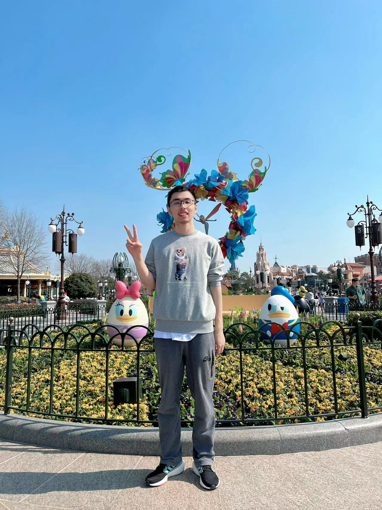

WANG Yuqi 
Email: 1250378468@qq.com

## Education Background                                                           
- Tongji University, Bachelor of Engineering 09/2018-07/2022  
	Major: Software Engineering; 
	GPA: 4.67/5.0
- The University of Hong Kong, Master of Computer Science 09/2022-now 
	Advisor: Liu Qi

## Internship                                                           
- Tencent Aurora Studios, Client Game Developer Intern               07/2021-10/2021  
- Student Research Assistant with Professor Liuqi in HKU 					   10/2022-		

## Awards                                                                      
- Gold Medal, The 2020 International Collegiate Programming Contest (ICPC) Asia Yinchuan Regional Contest
- Gold Medal, The 45th ICPC Asia Regional Contest Shanghai Site 2020
- First Prize, 2021 Group Programming Ladder Tournament
- The First Prize Scholarship, Tongji University, 2018-2019
- The China Postgraduate Scholarships for Computer Science, The University of Hong Kong, 2022-2023

