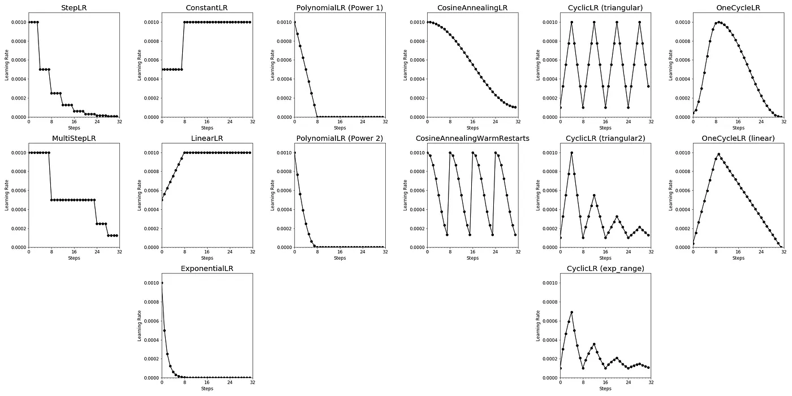

It's a summary originating from [here](https://towardsdatascience.com/a-visual-guide-to-learning-rate-schedulers-in-pytorch-24bbb262c863)

[PyTorch Documentation](https://pytorch.org/docs/stable/optim.html)

