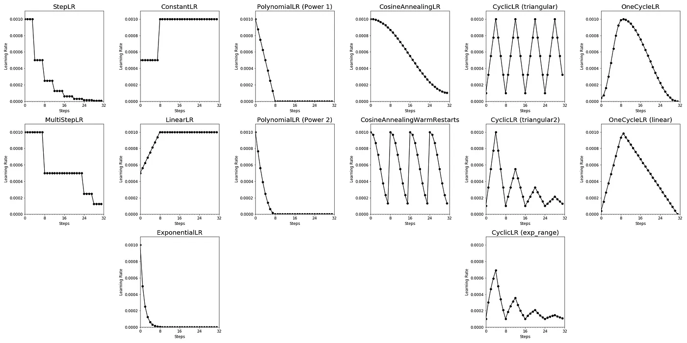

It's a summary of the [blog](https://towardsdatascience.com/a-visual-guide-to-learning-rate-schedulers-in-pytorch-24bbb262c863)


[PyTorch Documentation](https://pytorch.org/docs/stable/optim.html)



## CosineAnnealingLR
```python
from torch.optim.lr_scheduler import CosineAnnealingLR
scheduler = CosineAnnealingLR(
    optimizer,
    T_max = 32,  # Maximum number of iterations.
    eta_min = 1e-4  # Minimum learning rate.
) 
```
