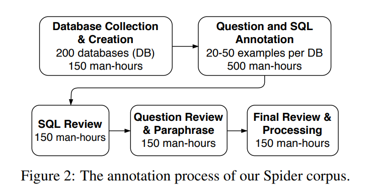

## Benchmark
**Spider: A Large-Scale Human-Labeled Dataset for Complex and Cross-Domain Semantic Parsing and Text-to-SQL Task**

-----
**DS-1000: A Natural and Reliable Benchmark for Data Science Code Generation**

## Dataset
**A parallel corpus of Python functions and documentation strings for automated code documentation and code generation**
- (python function, docstring) pairs scraped from Github.

-----
