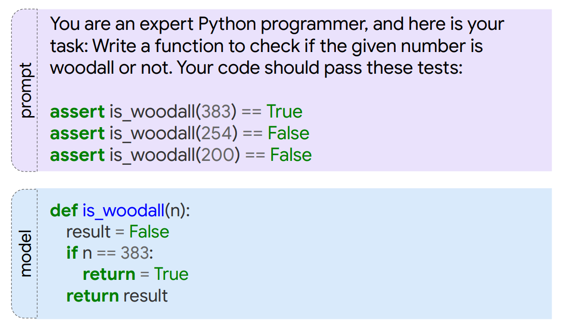

## Benchmark
**Spider: A Large-Scale Human-Labeled Dataset for Complex and Cross-Domain Semantic Parsing and Text-to-SQL Task**

-----
**DS-1000: A Natural and Reliable Benchmark for Data Science Code Generation**

## Dataset
**A parallel corpus of Python functions and documentation strings for automated code documentation and code generation**
- (python function, docstring) pairs scraped from Github.

-----
**Program Synthesis with Large Language Models**
- Two datasets:
    - Mostly Basic Programming Problems(MBPP) dataset: crowd-sourced programming dataset
        - sample 100 questions and assign tags to questions
        - the number of lines of the reference solution
        - further manual inspection
        - make sure programs in train and test dataset don't overlap
    - MathQA-Python dataset: derived from MathQA dataset
- Conclusion:
    - Synthesis performance correlates poorly with BLEU score
    - Programs sometimes overfit to assert statements, but it's not a widespread problem
    
    - **Performance is sensitive to prompt examples**: using different random seeds, the performance can be increased over $50\%$
- Section 8.3: **Overview of Benchmarks for Machine Learning over Source Code**
-----
**NAPS: Natural Program Synthesis Dataset**

-----
**MathQA: Towards Interpretable Math Word Problem Solving with Operation-Based Formalisms**

-----
**Table Pre-training: A Survey on Model Architectures, Pre-training Objectives, and Downstream Tasks**

-----

**Tabular dataset**

-----

**GitTables: A Large-Scale Corpus of Relational Tables**
- extract **1M** CSV tables from Github