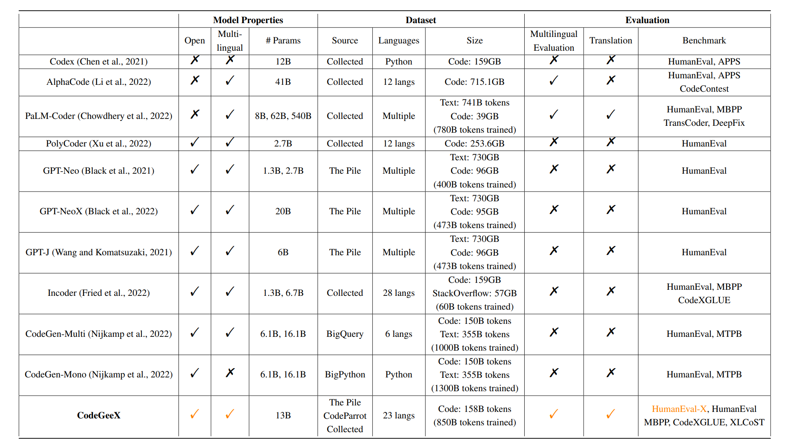

## [LiveCodeBench](https://arxiv.org/abs/2403.07974)

Evaluation problem from codeforce, atcoder, leetcode(only small number of problems from codeforce). LLMs struggle on these problems.

## [Code Generation with AlphaCodium: From Prompt Engineering to Flow Engineering](https://arxiv.org/abs/2401.08500)

## [CodeGeeX](https://arxiv.org/abs/2303.17568)

## Meet in the Middle: A New Pre-training Paradigm
**great at code generation**

- a decoder-only transformer model trained both forward and backward.
    - next word prediction loss(forward)
    - previous word prediction loss(backward)
    - agreement loss(distance between forward and backward represetations of tokens)
- When inferring, synchronously generate tokens from both ends. (meet in the middle)

## CodeGen2: Lessons for Training LLMs on Programming and Natural Languages

## StarCoder: may the source be with you!
- # TODO
- Use **JupyText** to deal with Jupyter notebooks
- evaluate on **DS-1000** dataset
