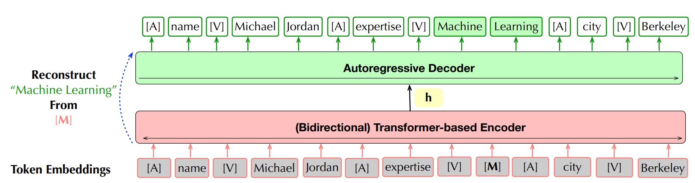

-----
**RPT: Relational Pre-trained Transformer Is Almost All You Need towards Democratizing Data Preparation**

Fine-tuning BART to do data preparation tasks:
> Data preparation — including data cleaning, data transformation, entity resolution, information extraction, and so forth

- encoder-decoder architecture, masked prediction

- use BART as baseline, evaluate on some unseen tables from Google and Amazon. Mask some cells and values on the table. Then use model to predict the value. Use f1 score as metric.

-----

