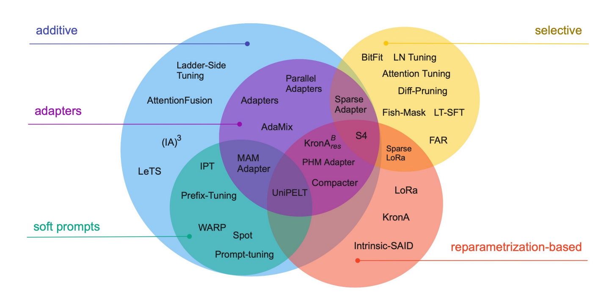

- [Data Collection \& Preprocessing](#data-collection--preprocessing)
- [Model Design](#model-design)
- [Pre-training](#pre-training)
- [Fine-tuning](#fine-tuning)
- [Inference](#inference)
- [Model Selection](#model-selection)

## Data Collection & Preprocessing 

## Model Design

## Pre-training

## Fine-tuning

**Scaling Down to Scale Up: A Guide to Parameter-Efficient Fine-Tuning**

-----

**Fine-Tuning Language Models with Just Forward Passes**

-----

**QLoRA: Efficient Finetuning of Quantized LLMs**

## Inference

## Model Selection

